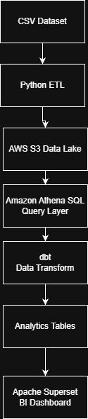

# Financial Data Lake Analytics Pipeline

This project demonstrates a **modern cloud-based data engineering pipeline** built on AWS.
It ingests raw financial data, processes it through an ETL pipeline, transforms it using dbt, and visualizes insights through a BI dashboard.

---

## Architecture



---

## Tech Stack

* Python (ETL pipeline)
* AWS S3 (Data Lake storage)
* Amazon Athena (Serverless SQL queries)
* dbt (Data transformations)
* GitHub Actions (CI/CD automation)
* Amazon QuickSight (Business Intelligence dashboard)

---

## Project Workflow

1. Raw financial data is ingested as CSV files.
2. Python scripts clean and prepare the dataset.
3. Cleaned data is stored in an AWS S3 data lake.
4. Amazon Athena queries the data directly from S3.
5. dbt transforms the data into analytics-ready tables.
6. GitHub Actions automatically runs dbt pipelines on every commit.
7. Amazon QuickSight visualizes insights through dashboards.

---

## Key Features

* Serverless cloud architecture
* Automated data transformations with dbt
* CI/CD pipeline for analytics workflows
* Data lake architecture
* Interactive BI dashboards

---

## Repository Structure

```
aws-financial-data-pipeline/

data/
raw financial datasets

etl/
python data cleaning scripts

financial_dbt/
dbt models and transformations

terraform/
infrastructure as code

.github/workflows/
CI/CD pipelines

docs/
architecture diagram and documentation
```

---

## Example Analytics

The pipeline generates analytics tables such as:

* Revenue by region
* Daily revenue trends
* Transaction volume
* Average transaction value

These tables power the BI dashboard.

---

## Future Improvements

* Machine learning revenue forecasting
* Data quality monitoring
* Automated anomaly detection
* Streaming ingestion pipeline

---

## Author

Nelson Villalba
Data & Automation Projects
