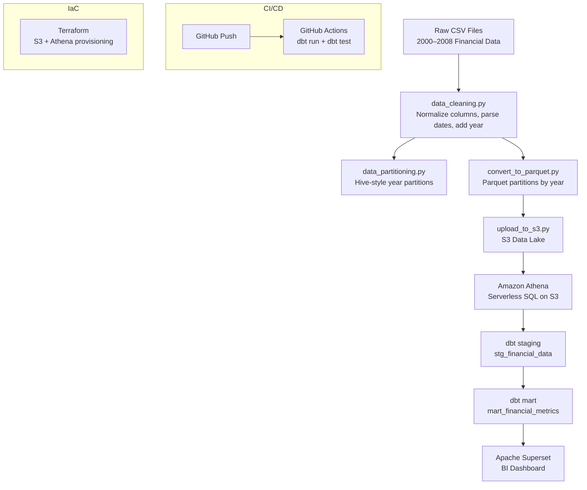

# AWS Financial Data Pipeline

> A production-style cloud data engineering pipeline that ingests raw financial market data, transforms it with dbt, and visualizes analytics through Apache Superset — all running on a serverless AWS architecture.

## 🚦 Status

`Functional`

Core pipeline runs end-to-end: raw CSV ingestion → cleaned & partitioned data → S3 data lake → Athena queries → dbt transformations → Superset dashboards. CI/CD is live via GitHub Actions.

---

## 🧠 Overview

This project demonstrates a modern data engineering stack applied to real financial market data spanning from 2000 to 2008. The dataset covers daily records for major stock indices (S&P 500, NASDAQ, Dow Jones) combined with macroeconomic indicators such as GDP growth, inflation, unemployment, commodity prices, and forex rates.

The pipeline follows a medallion-style architecture: raw CSV files are cleaned and partitioned by year using Python, converted to Parquet, uploaded to an S3 data lake, and queried via Amazon Athena. dbt then applies SQL transformations to produce analytics-ready mart tables, which power a dashboard built in Apache Superset.

Infrastructure is fully provisioned with Terraform (S3 bucket + Athena database), and dbt pipelines are automated through a GitHub Actions CI/CD workflow that runs on every push to `main`. An Apache Airflow DAG is also included as an alternative orchestration layer for scheduled daily runs.

The project was built as a portfolio piece to demonstrate real-world skills across the full data engineering lifecycle — from raw data ingestion to BI visualization.

---

## 🏗️ Architecture


```mermaid
flowchart TD
    A[Raw CSV Files\n2000–2008 Financial Data] --> B[data_cleaning.py\nNormalize columns, parse dates, add year]
    B --> C[data_partitioning.py\nHive-style year partitions]
    B --> D[convert_to_parquet.py\nParquet partitions by year]
    D --> E[upload_to_s3.py\nS3 Data Lake]
    E --> F[Amazon Athena\nServerless SQL on S3]
    F --> G[dbt staging\nstg_financial_data]
    G --> H[dbt mart\nmart_financial_metrics]
    H --> I[Apache Superset\nBI Dashboard]

    subgraph CI/CD
        J[GitHub Push] --> K[GitHub Actions\ndbt run + dbt test]
    end

    subgraph IaC
        L[Terraform\nS3 + Athena provisioning]
    end
```

---

## 🛠️ Tech Stack

| Layer | Technology |
|---|---|
| Language | Python 3.11 |
| Data Processing | pandas, pyarrow |
| Storage | AWS S3 (Hive-partitioned Parquet) |
| Query Engine | Amazon Athena (serverless SQL) |
| Transformations | dbt-core + dbt-athena-community |
| Infrastructure as Code | Terraform (AWS provider 6.35) |
| Orchestration (CI) | GitHub Actions |
| Orchestration (scheduled) | Apache Airflow |
| Visualization | Apache Superset |
| Containerization | Docker, Docker Compose |
| AWS SDK | boto3 |

---

## 📁 Project Structure

```
aws-financial-data-pipeline/
├── data/
│   ├── raw/                          # Source CSV (finance_economics_dataset.csv)
│   ├── processed/                    # Cleaned single CSV
│   ├── processed_partitioned/        # CSV partitioned by year (year=YYYY/data.csv)
│   └── processed_parquet/            # Parquet partitioned by year
├── scripts/
│   ├── data_cleaning.py              # Column normalization, date parsing, year column
│   ├── data_partitioning.py          # Hive-style CSV partitioning
│   ├── convert_to_parquet.py         # CSV → Parquet conversion
│   ├── upload_to_s3.py               # Recursive S3 upload with folder preservation
│   └── data_profiling.py             # Exploratory analysis script
├── financial_dbt/
│   ├── models/
│   │   ├── staging/
│   │   │   ├── sources.yml           # Athena source declaration
│   │   │   ├── stg_financial_data.sql
│   │   │   └── stg_financial_data.yml
│   │   └── marts/
│   │       ├── mart_financial_metrics.sql
│   │       └── mart_financial_metrics.yml
│   └── dbt_project.yml
├── airflow/
│   └── dags/
│       └── financial_pipeline_dag.py  # Daily dbt run + test DAG
├── dashboards/
│   └── superset/
│       ├── Dockerfile                 # Custom Superset with pyathena
│       └── docker-compose.yml
├── terraform/
│   ├── provider.tf
│   ├── s3.tf                          # S3 bucket: nelson-financial-data-lake-001
│   └── athena.tf                      # Athena DB: financial_data_lake
├── .github/
│   └── workflows/
│       └── dbt_pipeline.yml           # CI: install dbt → configure AWS → run → test
├── run_pipeline.py                    # Main entry point: orchestrates all 4 steps
├── Dockerfile
└── requirements.txt
```

---

## ⚙️ Setup & Installation

### Prerequisites

- Python 3.10+
- AWS account with S3 + Athena access
- Terraform CLI installed
- Docker + Docker Compose (for Superset)
- dbt-core and dbt-athena-community

### Steps

```bash
# 1. Clone the repo
git clone https://github.com/nelsonv26/aws-financial-data-pipeline.git
cd aws-financial-data-pipeline

# 2. Install Python dependencies
pip install -r requirements.txt

# 3. Provision AWS infrastructure
cd terraform
terraform init
terraform apply

# 4. Configure AWS credentials
mkdir -p ~/.aws
# Add your credentials to ~/.aws/credentials

# 5. Run the full pipeline
python run_pipeline.py

# 6. Install dbt and run transformations
pip install dbt-core dbt-athena-community
cd financial_dbt
dbt deps
dbt run
dbt test

# 7. Start Superset
cd dashboards/superset
docker-compose up --build
```

### Environment Variables

| Variable | Description | Required |
|---|---|---|
| `AWS_ACCESS_KEY_ID` | AWS access key | Yes |
| `AWS_SECRET_ACCESS_KEY` | AWS secret key | Yes |
| `AWS_DEFAULT_REGION` | AWS region (default: us-east-1) | Yes |
| `SUPERSET_SECRET_KEY` | Superset app secret key | Yes (for Superset) |

For GitHub Actions CI, add `AWS_ACCESS_KEY_ID` and `AWS_SECRET_ACCESS_KEY` as repository secrets.

---

## 🚀 Usage

### Run the full ETL pipeline

```bash
python run_pipeline.py
```

This executes four sequential steps:
1. **Clean** — normalizes column names, parses dates, adds year column
2. **Partition** — splits data into `year=YYYY/data.csv` Hive-style folders
3. **Convert** — produces Parquet files partitioned by year
4. **Upload** — pushes Parquet files to S3 under `processed_parquet/`

### Run dbt transformations manually

```bash
cd financial_dbt
dbt run      # Build staging + mart models in Athena
dbt test     # Validate not_null constraints
```

### Access Superset dashboard

```bash
cd dashboards/superset
docker-compose up
# Open http://localhost:8088
```

Connect to Athena using the PyAthena SQLAlchemy connection string:
```
awsathena+rest://:@athena.us-east-1.amazonaws.com:443/financial_data_lake?s3_staging_dir=s3://nelson-financial-data-lake-001/
```

---

## 📊 Analytics Produced

The `mart_financial_metrics` model aggregates:

- **Average close price** by stock index and year
- **Total trading volume** by stock index and year

The dataset covers daily records for S&P 500, NASDAQ, and Dow Jones from 2000 to 2008, including macroeconomic fields: GDP growth, inflation rate, unemployment rate, interest rate, crude oil price, gold price, forex (USD/EUR, USD/JPY), and more.

---

## 🔮 Roadmap / Next Steps

- Add intermediate dbt model for macroeconomic correlation analysis
- Implement data quality tests for numeric ranges (e.g., price > 0)
- Add a `mart_macro_indicators` model aggregating economic time series
- Set up Airflow on MWAA (managed) instead of local Docker
- Stream ingestion layer with Kinesis Firehose
- Machine learning layer for revenue/index forecasting
- Automated anomaly detection on price + volume signals
- Add `dbt docs generate` step to GitHub Actions for lineage docs

---

## 📄 License

Personal portfolio project — MIT License.

---

## 👤 Author

**Nelson Villalba** — Data & Automation Projects  
GitHub: [@nelsonv26](https://github.com/nelsonv26)
